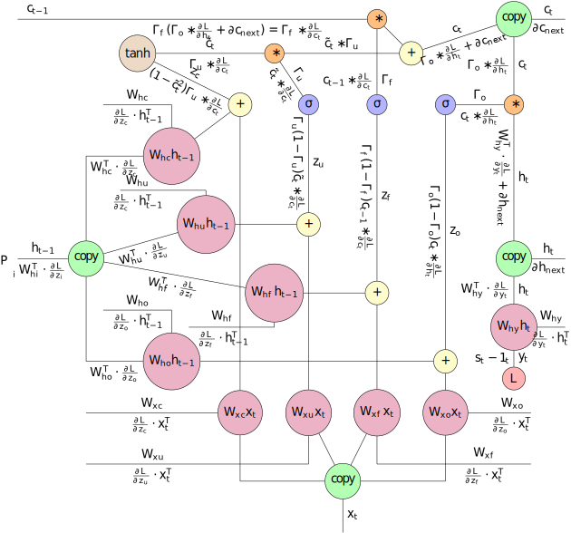

# LSTM_Character_Language_Model

## Character-level Language Model using a deep LSTM from scratch with python/JAX

This project contains python scripts and Colab notebooks for implementing and tuning a character-level, deep LSTM from scratch in python. 

The recurrent learning algorithm is based on the minimal code example 'min-char-rnn.py' provided by Andrej Karpathy in his popular tutorial on RNNs, [The Unreasonable Effectiveness of Reccurent Neural Networks](https://karpathy.github.io/2015/05/21/rnn-effectiveness/)  

The minimal code sample for the RNN network is great for understanding the steps of the learning algorithm. Especially, seeing this code helped me better comprehend the steps needed to perform backpropgation through time. However, in order to see the high quality results discussed by Andrej in his blog and paper, the vanilla RNN script requires several extensions:

  1. replacing RNN with either LSTM or GRU circuits which implement gates to store memory over longer sequences
 
  2. using deep networks with stacks of RNN units
  
  3. batch processing of samples
  
  4. static embedding layer before first LSTM layer 
  
  5. using adaptive learning rate optimization like ADAM or RMSprop
  
  6. code that can run on a GPU to speed up computations

To see the original torch/lua implementation by Andrej see here, and to see an updated version by __ see here.  

I wanted to see how many of the above exstensions could be realised from scratch with just python, and not relying on any particular high level deep learning framework. LSTMs are a widely applied and core component for huge variety of higher level models, so I wanted to really understand from the bottom up how they work in detail. 

Contents: 

* min-char-rnn.py - original minimal code for RNN algorithm in python by Andrej Karpathy 

* lstm_network1.py - module for a single layer LSTM in python, bundling the various methods and weights inside an LSTM class.

* jax_char_lstm.py - module for multi-layer LSTM which replaces numpy with jax.fastmat and jit functions for GPU compatibility/speed up. This verision is written as python library of indepedent functions without any classes in order to make working with JAX , and JIT.  

* Notebook1_RNN_vs_LSTM_Comparisons.ipynb - Colab notebook comparing the performance of the vanilla RNN code to the deep LSTM code

TODO!!!
_____

* Notebook2_LSTM_Tuning_Tests.ipynb

* Notebook3_LSTM_Training_LargeTextCorpus - testing on a much larger test corpus to compare performance and results 

